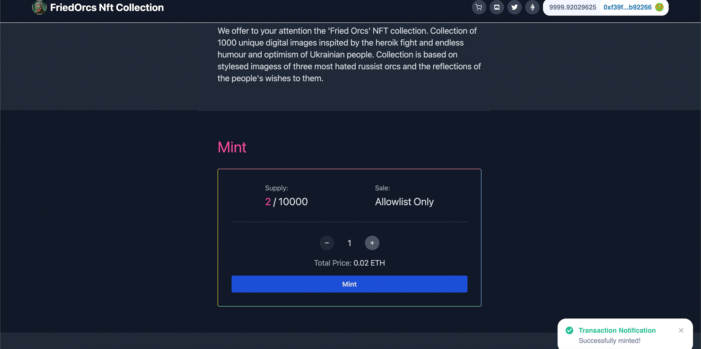

# [Next.js](https://nextjs.org/) NFT Mint dApp (Fried Orcs)

A simple, fast and modern dApp for minting NFTs.



> This dApp is designed with the assumption that [Hardhat NFT Smart Contract](https://github.com/a5node/hardhat-nft-smart-contract) will be used for the backend. First you need to deploy the smart contract to get the contract address and ABI. Otherwise, the dApp will not work. If you want to use your own smart contract, manually set your contract addresses (`config/contract-config.json`) and ABI (`config/abi.json`). But in that case, it can be complicated because you need to modify the source code of the dApp (some function names, configurations, etc.).

## Usage
Set up the env files:

Copy the .env(.\*).example files to .env(.\*):

```sh
cp .env.example .env
cp .env.development.example .env.development
cp .env.production.example .env.production
```

Replace the values in the env files with yours as needed.

Set up the config file:

Replace the values in `config/contract-config.json` with yours. This file is shared with the [backend](https://github.com/a5node/hardhat-nft-smart-contract).

Make an allowlist (if needed):

Include the applicable addresses in `config/allowlist.json`.

Other settings:

- Replace the images in `public/assets/` with yours
- Replace the favicon files in `public/favicon/` with yours ([Favicon Generator](https://realfavicongenerator.net/))
- You can change the global background color and text color in `pages/_document.tsx`
- You can set your own default styles for specific elements in `styles/globals.css` ([Adding Custom Styles](https://tailwindcss.com/docs/adding-custom-styles))

Run the server:

```sh
npm run dev
```

## Deploy your dApp

- [Vercel](https://vercel.com/) - The easiest way to deploy your Next.js app
- [Fleek](https://fleek.co/) - Deploy your sites & apps on [IPFS](https://ipfs.io/)

> If you're deploying your dApp to Fleek, uncomment Loader Configuration in `next.config.js`.

> Fleek may take some time for the images to appear after deployment.

Check out the [Next.js deployment documentation](https://nextjs.org/docs/deployment) for more details.
